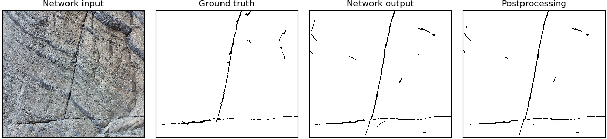
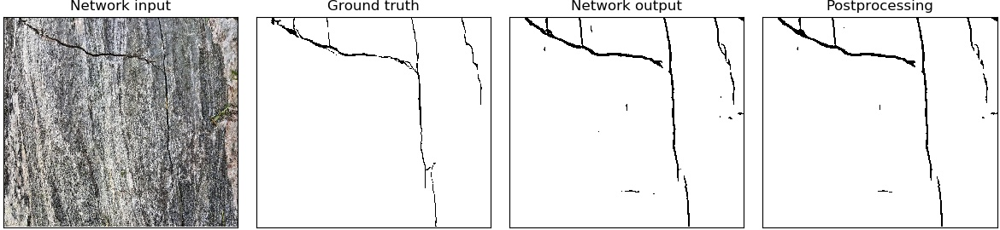
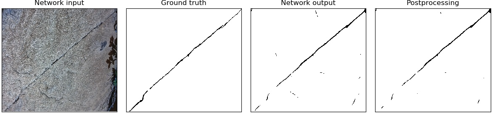

# Rock-fracture-segmentation-with-Tensorflow

Author's implementation of [A deep convolutional neural network for rock fracture image segmentation](https://link.springer.com/article/10.1007/s12145-021-00650-1)

In this project, [Labelme](https://github.com/wkentaro/labelme) is used for data labeling and [DenseCRF](https://github.com/lucasb-eyer/pydensecrf) is used for postprocessing.
These two libraries must be installed.

## Requirement
Tensorflow 1.x

## How to run
This repository does not provide train data, only test data used for test in the paper. 
Test data is in the ``images`` folder and has been created through [Labelme](https://github.com/wkentaro/labelme).

First, download this repository.
```
git clone https://github.com/Montherapy/Rock-fracture-segmentation-with-Tensorflow.git
```
Then, we can get preprocessed images in the ``images`` folder by applying CLAHE (Contrast Limited Adaptive Histogram Equalization).
```
python preprocess.py
```
Input data ``x_test.npy`` and labels ``y_test.npy`` can be obtained through the following process.
```
python datamaker.py
```
The default setting is to create test input, and if you want to train with your own labeled data, you can modify it to create train input by adjusting the ``data_type`` parameter in the ``datamaker.py``.

The segmentation result of the network can be obtained through ``main.py``, and the softmax value is created for postprocessing.
```
python main.py
```
Currently, model5, which has the best performance, is used, and all trained models used for testing in the paper can be found in the ``logs`` folder.
If you use the ``train`` function instead of the ``test`` function in ``main.py``, it switches to training mode.

Postprocessing and the resulting images can be obtained as follows.
```
python postprocess.py
```
The resulting image is saved in the ``result_fig`` folder.

## Segmentation result example





